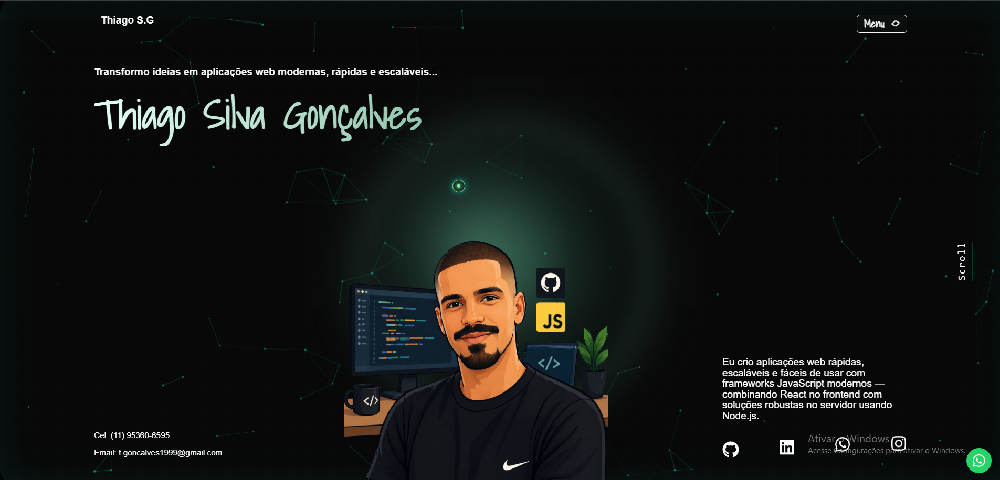

# 🚀 Thiago SG

### Portfólio profissional focado em conversão, performance e experiência do usuário

🔗 **Demonstração ao vivo:**  
https://thiago-tsg.github.io/Portifolio/

---

## 📸 Prévia



---

## ✨ Sobre o projeto

Esse projeto **Thiago SG** é um portfólio desenvolvido para apresentar projetos de forma estratégica, indo além do visual e destacando o **valor real entregue em cada solução**.

O objetivo não é apenas exibir interfaces, mas comunicar **problemas resolvidos, decisões técnicas e impacto gerado**.

---

## 🎯 Objetivo

Transformar um portfólio comum em uma **ferramenta focada em conversão**, capaz de:

- capturar atenção  
- demonstrar autoridade técnica  
- comunicar valor com clareza  
- gerar oportunidades reais (freelance ou contratação)  

---

## 💡 Abordagem

Cada projeto é estruturado como um estudo de caso real:

- 🚨 Problema  
- 💡 Solução  
- ⚙️ Tecnologias  

Isso transforma o portfólio em uma **apresentação orientada a produto**, e não apenas em uma galeria visual.

---

## ⚙️ Funcionalidades

- 📂 Grade interativa de projetos  
- 🖼️ Modal com carrossel de imagens  
- 📖 Visualização de estudos de caso (problema, solução e tecnologias)  
- 📱 Layout totalmente responsivo  
- ⚡ Navegação SPA com React Router  
- 🎨 Animações avançadas e microinterações  
- 💬 Contato direto via WhatsApp  
- 📄 Página de currículo integrada  

---

## 🧠 Destaques técnicos

### ⚡ Performance
- Scroll otimizado utilizando `requestAnimationFrame`  
- Animações eficientes com `IntersectionObserver`  
- Redução de reflows e custo de renderização  

### 🎨 Interatividade
- Efeito dinâmico de digitação  
- Animações baseadas em scroll  
- Cursor interativo com efeito glow  
- Sistema de modais com controle de estado  
- Suporte ao teclado (ESC para fechar)  

### 🧱 Arquitetura
- Estrutura de componentes reutilizáveis  
- Separação clara de responsabilidades  
- Modelo de dados escalável para projetos  
- Uso avançado de hooks do React  

---

## 🧩 Fluxo de UX

1. Entrada visual impactante  
2. Apresentação pessoal  
3. Skills e resumo profissional  
4. Exploração de projetos  
5. Estudos de caso aprofundados  
6. Ações de conversão  

---

## 📄 Página de currículo

Rota dedicada incluindo:

- Layout profissional  
- Sistema de grid responsivo  
- Animações baseadas em scroll  
- Navegação fluida  

---

## 🛠️ Stack Tecnológica

- React + Vite  
- JavaScript  
- SCSS  
- React Router  
- tsparticles  
- React Icons  

---

## 🚀 Como executar

```bash
git clone https://github.com/thiago-tsg/Portifolio.git
cd Portifolio
npm install
npm run dev
```